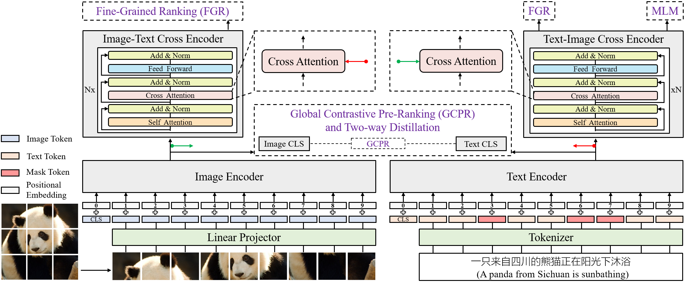

# Zero and R2D2: A Large-scale Chinese Cross-modal Benchmark and A Vision-Language Framework

This repo is the official implementation of <a href="https://arxiv.org/abs/2205.03860">R2D2</a>. It includes datasets, code, and models as following:

&#x2705;<a href="http://zero.so.com">Zero benchmark</a> is available. The detailed introduction and download URL are in **http://zero.so.com**.

&#x2705;Pre-trained checkpoints.

&#x2705;Inference demo.

&#x274C;Fine-tuning code and checkpoints for Image-Text Retrieval and Image-Text Matching tasks (coming soon).

&#x274C;Pre-training code (coming soon).

## Requirements
<pre/>pip install -r requirements.txt</pre> 

## Pre-trained checkpoints
Pre-trained image-text pairs | R2D2ViT-L | PRD2ViT-L
--- | :---: | :---:
250M | <a href="https://drive.google.com/file/d/18Fd3vGvj0Dz8rPlxROxugjZaF8Z4jf7g/view?usp=sharing">Download</a> | <a href="https://drive.google.com/file/d/15zDdam7_-YT0suA3Wc226vvxcyBxWZ_O/view?usp=sharing">Download
23M | <a href="https://drive.google.com/file/d/1vvvMv3mTRFGAUojbSJoZiTuqYPJqIquh/view?usp=sharing">Download</a> | -
2.3M | <a href="https://drive.google.com/file/d/1SKH-d1Vd-1wn3qUt6YKnep7VsTXfbTK0/view?usp=sharing">Download</a> | -

## Inference demo
- To evaluate the pretrained R2D2 model on image-text pairs, run:
    <pre>python r2d2_inference_demo.py</pre> 
- To evaluate the pretrained PRD2 model on image-text pairs, run:
    <pre>python prd2_inference_demo.py</pre> 

### Citation
If you find this code to be useful for your research, please consider citing.
<pre>
@article{xie2022zero,
  title={Zero and R2D2: A Large-scale Chinese Cross-modal Benchmark and A Vision-Language Framework},
  author={Xie, Chunyu and Cai, Heng and Song, Jianfei and Li, Jincheng and Kong, Fanjing and Wu, Xiaoyu and Morimitsu, Henrique and Yao, Lin and Wang, Dexin and Zhang, Xiangzheng and Leng, Dawei and Ji, Xiangyang and Deng, Yafeng },
  journal={arXiv preprint arXiv:2205.03860},
  year={2022}
}</pre>
